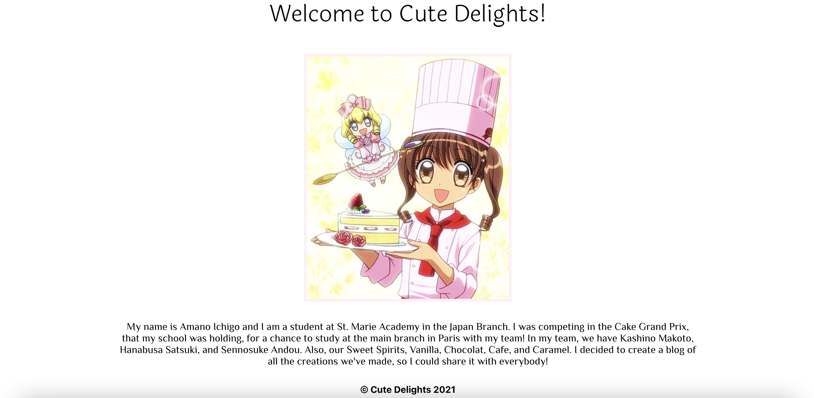

# Cute Delights
Welcome to Cute Delights! This is an app where I can create a blog post and add in recipes for the dessert I would like to add. There is also an About Me page.

## Technologies Used:
- HTML
- CSS3
- JavaScript
- Google Fonts
- Mongoose/MongoDB
- Express
- React
- Node JS

## Screenshots:
### Home

### Recipes

### About Me

## Getting Started: 
- Scroll through the page to read the posts
- Click through the nav bar to see the other pages
- Create a post on the home page

- App Link: https://cute-delights.herokuapp.com/

## Future Enhancements: 
- Add a timestamp of when it was created
- Have the newest post pop up at the top of the page
- Write/display the recipes information/include directions
- Create a scrollable list for the recipes information
